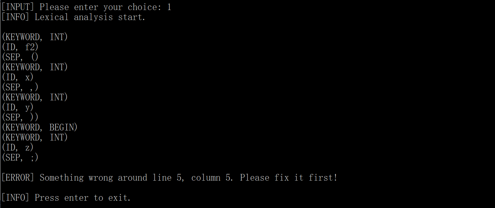

# TINY+词法分析、语法分析程序实验

### 实验概述

#### 目的

扩充已有的样例语言TINY，为扩展TINY语言TINY＋构造词法分析和语法分析程序，从而掌握词法分析和语法分析程序的构造方法 

#### 内容

了解样例语言TINY及TINY编译器的实现，了解扩展TINY语言TINY＋，用EBNF描述TINY＋的语法，用C语言扩展TINY的词法分析和语法分析程序，构造TINY＋的递归下降语法分析器。

#### 要求

将TINY＋源程序翻译成对应的TOKEN序列，并能检查一定的词法错误。将TOKEN序列转换成语法分析树，并能检查一定的语法错误。

### TINY语言

#### lexicon

+ Keywords:  **IF ELSE WRITE READ RETURN BEGIN END MAIN INT REAL**

+ Single-character separators：` ;` `,` `(`  `)`

+ Single-character operators：`+` `-` `*`  `/`

+ Multi-character operators：`:=` `==` `!=`

+ Identifier: An identifier consists of a letter followed by any number of letters or digits. The following are examples of identifiers: x, x2, xx2, x2x, End, END2. Note that **End** is an identifier while **END** is a keyword. The following are not identifiers:
  + `IF, WRITE, READ, ...` (keywords are not counted as identifiers)
  + `2x `(identifier can not start with a digit)
  + Strings in comments are not identifiers.

+ Number is a sequence of digits, or a sequence of digits followed by a dot, and followed by digits.  

  ```
  Number -> Digits | Digits '.' Digits
  Digits -> Digit | Digit Digits
  Digit  -> '0' | '1' | '2' | '3' | '4' | '5' | '6' | '7' | '8' | '9'
  ```

+ Comments： string between `/**` and `**/`. Comments can be longer than one line. 

#### The EBNF Grammar

##### High-level program structures

```
Program -> MethodDecl MethodDecl* 
MethodDecl -> Type [MAIN] Id '(' FormalParams ')' Block
FormalParams -> [FormalParam ( ',' FormalParam )* ]
FormalParam -> Type Id
 
Type -> INT | REAL
```

##### Statements

```
Block -> BEGIN Statement* END
 
Statement -> Block
           | LocalVarDecl  
           | AssignStmt   
           | ReturnStmt
           | IfStmt
           | WriteStmt
           | ReadStmt
        
LocalVarDecl -> INT Id ';' 
              | REAL Id ';' 
 
AssignStmt -> Id := Expression ';'
ReturnStmt -> RETURN Expression ';'
IfStmt -> IF '(' BoolExpression ')' Statement
        | IF '(' BoolExpression ')' Statement ELSE Statement
WriteStmt -> WRITE '(' Expression ',' QString ')' ';'
ReadStmt -> READ '(' Id ',' QString ')' ';'
QString is any sequence of characters except double quote itself, enclosed in double quotes.
```

##### Expressions     

```
Expression -> MultiplicativeExpr  (( '+' | '-' ) MultiplicativeExpr)*
MultiplicativeExpr -> PrimaryExpr (( '*' | '/' ) PrimaryExpr)*
PrimaryExpr -> Num  // Integer or Real numbers
             | Id            
             | '(' Expression ')'
             | Id '(' ActualParams ')'
BoolExpression -> Expression '==' Expression 
                 |Expression '!=' Expression   
ActualParams -> [Expression ( ',' Expression)*]
```

#### Sample program

```
 /** this is a comment line in the sample program **/
 INT f2(INT x, INT y ) 
 BEGIN 
    INT z;
    z := x*x - y*y;
    RETURN z; 
 END 
 INT MAIN f1() 
 BEGIN
    INT x;
    READ(x, "A41.input");
    INT y;
    READ(y, "A42.input");
    INT z;
    z := f2(x,y) + f2(y,x);
    WRITE (z, "A4.otput"); 
 END
```

### TINY＋

基于上述TINY语言的定义，对于TINY语言进行以下内容的扩充，构造扩展TINY语言TINY＋：

#### 增加内容

+ Keywords： **WHILE** 、**DO**、**FOR**、**UPTO**、**DOWNTO**
+ Single-character operators：`%`（求余运算），`<`，`>`（比较运算符）

#### New EBNF Grammar

以下仅列出与TINY语法相比，有修改的部分：

```
Statement -> Block
           | LocalVarDecl  
           | AssignStmt   
           | ReturnStmt
           | IfStmt
           | WriteStmt
           | ReadStmt
           | WhileStmt
           | DoWhileStmt
           | ForStmt

WhileStmt -> WHILE '(' BoolExpression ')' Statement
DoWhileStmt -> DO Statement WHILE '(' BoolExpression ')'
ForStmt -> For AssignStmt UPTO Expression DO Statement
         | For AssignStmt DOWNTO Expression DO Statement

MultiplicativeExpr -> PrimaryExpr (( '*' | '/' | '%' ) PrimaryExpr)*
BoolExpression -> Expression '==' Expression
                | Expression '!=' Expression 
                | Expression '>' Expression
                | Expression '<' Expression
```

### 实验环境

+ OS： Windows 10
+ IDE： Visual Studio 2017
+ Language： C

### 具体实现

以下会对于程序做一个简单的分析，完整代码见`src`文件

#### 词法分析

词法分析器的主要工作就是从输入中读取字符，按照预设的规则来识别它们，得到“词法单元对象”——`TOKEN`，然后打印输出即可。

##### TOKEN类型

基于上文Tiny+程序的定义，可以对于程序中可能会出现的字划分类别，并分别给他们一个标识符，方便我们对于token的操作。

```c
// token类型
typedef enum {
	// 保留字
	IF, ELSE, WRITE, READ, RETURN, BEGIN, END, MAIN, INT, REAL, WHILE, DO, FOR, UPTO, DOWNTO,

	// 分隔符
	SEMI, COMMA, LEFTPAREN, RIGHTPAREN,

	// 运算符
	ADD, SUB, MUL, DIV, MOD, ASSIGN, EQUAL, UNEQUAL, GT, LT,
	
	// ID NUM
	ID, NUM, QSTR,

	// other
	ERROR, ENDFILE
}TokenType;
```

##### DFA

识别Token的主要过程是在确定的有限自动机的状态之间进行切换，通过检查下一个扫描的字符决定跳转到哪个状态。

例如，初始状态为`STATUS_START`，此时如果读取到的下一个字符为数字，根据Tiny+语言的词法定义，以数字开头的只可能为数字，所以，我们跳转到`STATUS_NUMBER`状态。进入该状态后，如果下一个字符还是数字，意味着这个数字还没结束，因此保持当前DFA状态不变。当得到的下一个字符为小数点`.`，就跳转到`STATUS_REAL`状态，表示可以确定这个数为小数，如果既不是数字也不是小数点，就跳转到`STATUS_DONE`状态，意味着当前的`TOKEN`读取完毕，打印当前`TOKEN`即可。

在`STATUS_REAL`状态中，我们只要读取到不是数字就马上结束，跳转到`STATUS_DONE`状态，因为不会有两个小数点。

又例如，对于像`+`，`-`，`*`，`/`等操作符的读取，实际上是不需要给定一个状态的，因为它只有一个字符，读取后直接跳转到结束状态

特别的，在状态机中，我们不特别区分标识符和保留字，而是统一的跳转到`STATUS_ID`状态，只需要在最后查找一下识别得到的字符串是不是保留字即可。

本程序中所有的DFA状态如下：

```c
// DFA的状态
typedef enum {
	STATUS_START,
	STATUS_ASSIGN,
	STATUS_EQUAL,
	STATUS_UNEQUAL,
	STATUS_COMMENT,
	STATUS_NUMBER,
	STATUS_REAL,
	STATUS_STR,
	STATUS_ID,
	STATUS_DONE 
}lexStatus;
```

##### 主函数`getToken`

主函数比较长，这里就不贴出了，主要的实现原理在上文已经做了解释，即通过DFA状态转换判断`TOKEN`类型，然后交由打印函数根据`TOKEN`类型进行打印即可。

本程序中，`getToken`函数只处理单个`TOKEN`，注意到，我们在之前的`TOKEN`类型定义中，有`ENDFILE`类型，当我们读取到文件末尾时得到的`TOKEN`类型就是`ENDFILE`。所以在外面套一层`while`循环，判断源文件是否结束，即可处理整个程序文件，如下：

```c
while (getToken() != ENDFILE);
```

#### 语法分析

语法分析采用自顶向下分析法。通过预测分析法，即向前看一个词法单元的形式，确定对于某个非终结符号将要选择的产生式，并采取递归的方式不断的对于非终结符号展开其产生式，最终得到一颗语法生成树。

##### 数据结构定义

由于我们最终的目标是生成一颗语法分析树，所以有必要对于树节点的类型进行定义，以便于我们在写程序时进行区分。以下是本程序的树节点类型以及节点结构体定义：

```c
typedef enum { MethodK, TypeK, ParamK, StmtK, ExpK } NodeKind;
typedef enum { MainK, NormalK } MethodKind;
typedef enum { FormalK, ActualK, NoneK } ParamKind;
typedef enum { ReturnTypeK, IntTypeK, RealTypeK } TypeKind;
typedef enum { IfK, WhileK, DoWhileK, ForK, ReturnK, AssignK, ReadK, WriteK, IntDeclareK, RealDeclareK } StmtKind;
typedef enum { OpK, ConstK, IdK, MethodCallK} ExpKind;

// 语法分析树结构体 - 多叉树
typedef struct
{
	struct TreeNode* child[MAXCHILDREN];         // 当前函数子树
	struct TreeNode* sibling;                    // 指向下一个函数
	NodeKind nodekind;                           // 节点类型
	union { MethodKind method; TypeKind type; StmtKind stmt; ExpKind exp; } kind;  // 子类型
	union {
		TokenType token;
		int val;
		char * name;
	} attr;
}TreeNode;
```

##### 树节点的构建

在本程序中，当选择语法分析功能时，语法分析树节点的构建与词法分析同步进行，也就是说，词法分析每得到一个`TOKEN`，就同时检查这个`TOKEN`是否符合语法。

树的构造使用递归的方法，主函数如下：

```c
TreeNode* parse(void) {
	TreeNode * root;
	token = getToken();
	root = MethodDecl_Sequence();
	if (token != ENDFILE) {
		syntaxError("Code ends before file");
	}
	return root;
}
```

通过分析Tiny+语法我们可以得知，Tiny+程序的主体就是一个一个函数组成的，所以，我们在主函数中，调用了`MethodDecl_Sequence()`函数，该函数会调用`MethodDecl()`函数，创建函数串联起来，而`MethodDecl()`函数，又会向下进一步调用`Block()`……通过这样的方式，我们就实现了自顶向下的语法分析。

以下面这个函数说明预测分析的实现：

```c
static TreeNode* Statement(void) {
	TreeNode* t = NULL;
	switch (token) {
	case BEGIN: t = Block(); break;
	case INT: t = IntLocalVarDeclStmt(); break;
	case REAL: t = RealLocalVarDeclStmt(); break;
	case ID: t = AssignStmt(); break;
	case RETURN: t = ReturnStmt(); break;
	case IF: t = IfStmt(); break;
	case WHILE: t = WhileStmt(); break;
	case DO: t = DoWhileStmt(); break;
	case FOR: t = ForStmt(); break;
	case WRITE: t = WriteStmt(); break;
	case READ: t = ReadStmt(); break;
	default:
		syntaxError("Unexpected token");
		break;
	}
	return t;
}
```

可以看到，该函数用于展开`Statement`，经过对于语法的分析，对于以`Statement`为产生式头的产生式体，不存在左公因子，这也就意味着，我们通过向前看一位（即预测）的方式，就可以确定使用哪个产生式，进而进一步展开了。上述函数的实现就是这个道理，函数中`token`已经是预测得到的结果。而对于产生式体中不存在的`token`，会直接报错。

##### 语法树的打印

对于整棵树的打印，我按照类似于先序遍历的方式打印节点，这样的顺序可以较好的还原源程序的执行顺序，同时所有的子节点会相对于父节点有一定的缩进，以更好的显示树的层次。具体见源代码中的`printTree()`函数，该函数根据不同的节点类型，执行不同的打印策略。

打印的具体结果见后文。

#### 错误检测与定位

本程序在实现上述词法分析和语法分析两大功能的同时，还实现了对于错误的一定程度上的检测，不仅可以提示错误的相关类型，还可以定位错误到行、列。

上文提到语法分析和词法分析可以同步进行，得到一个`TOKEN`就进行分析，这同时也方便了我们对于错误的定位，因为本程序正是通过在扫描字符的同时记录当前的行号和列号实现定位功能。

### 测试

测试文件使用了绝对路径，若想要在自己机器上测试，请修改路径，或者修改`mian.c`中的宏定义`#define TEST TRUE`为`FALSE`，程序会提示要求手动输入TINY代码文件的路径。

#### 主页面


#### TINY代码测试

首先，使用提供好的TINY样例代码进行测试：（具体代码见上文）

##### 词法分析结果

由于结果太长，无法截图，所以对结果进行了复制。

```/
[INPUT] Please enter your choice: 1
[INFO] Lexical analysis start.
(KEYWORD, INT)
(ID, f2)
(SEP, ()
(KEYWORD, INT)
(ID, x)
(SEP, ,)
(KEYWORD, INT)
(ID, y)
(SEP, ))
(KEYWORD, BEGIN)
(KEYWORD, INT)
(ID, z)
(SEP, ;)
(ID, z)
(OP, :=)
(ID, x)
(OP, *)
(ID, x)
(OP, -)
(ID, y)
(OP, *)
(ID, y)
(SEP, ;)
(KEYWORD, RETURN)
(ID, z)
(SEP, ;)
(KEYWORD, END)
(KEYWORD, INT)
(KEYWORD, MAIN)
(ID, f1)
(SEP, ()
(SEP, ))
(KEYWORD, BEGIN)
(KEYWORD, INT)
(ID, x)
(SEP, ;)
(KEYWORD, READ)
(SEP, ()
(ID, x)
(SEP, ,)
(QString, A41.input)
(SEP, ))
(SEP, ;)
(KEYWORD, INT)
(ID, y)
(SEP, ;)
(KEYWORD, READ)
(SEP, ()
(ID, y)
(SEP, ,)
(QString, A42.input)
(SEP, ))
(SEP, ;)
(KEYWORD, INT)
(ID, z)
(SEP, ;)
(ID, z)
(OP, :=)
(ID, f2)
(SEP, ()
(ID, x)
(SEP, ,)
(ID, y)
(SEP, ))
(OP, +)
(ID, f2)
(SEP, ()
(ID, y)
(SEP, ,)
(ID, x)
(SEP, ))
(SEP, ;)
(KEYWORD, WRITE)
(SEP, ()
(ID, z)
(SEP, ,)
(QString, A4.output)
(SEP, ))
(SEP, ;)
(KEYWORD, END)

[INFO] Lexical analysis finished.
```

##### 语法分析结果


#### TINY+代码测试

向原TINY样例代码中加入我们新增的一些关键字和语法，产生如下TINY+测试代码：

```/
/** this is a comment line in the sample program **/
 INT f2(INT x, INT y ) 
 BEGIN 
    INT z;
    z := 10;
    WHILE (z > 0)
        z := z % 2;
    RETURN z; 
 END 
 INT MAIN f1() 
 BEGIN
    INT x;
    READ(x, "A41.input");
    INT y;
    READ(y, "A42.input");
    INT z;
    z := f2(x,y) + f2(y,x);
    FOR x := 10; DOWNTO 5 DO y := x;
    WRITE (z, "A4.output"); 
 END
```

##### 词法分析结果

```/
[INPUT] Please enter your choice: 1
[INFO] Lexical analysis start.

(KEYWORD, INT)
(ID, f2)
(SEP, ()
(KEYWORD, INT)
(ID, x)
(SEP, ,)
(KEYWORD, INT)
(ID, y)
(SEP, ))
(KEYWORD, BEGIN)
(KEYWORD, INT)
(ID, z)
(SEP, ;)
(ID, z)
(OP, :=)
(NUM, 10)
(SEP, ;)
(KEYWORD, WHILE)
(SEP, ()
(ID, z)
(OP, >)
(NUM, 0)
(SEP, ))
(ID, z)
(OP, :=)
(ID, z)
(OP, %)
(NUM, 2)
(SEP, ;)
(KEYWORD, RETURN)
(ID, z)
(SEP, ;)
(KEYWORD, END)
(KEYWORD, INT)
(KEYWORD, MAIN)
(ID, f1)
(SEP, ()
(SEP, ))
(KEYWORD, BEGIN)
(KEYWORD, INT)
(ID, x)
(SEP, ;)
(KEYWORD, READ)
(SEP, ()
(ID, x)
(SEP, ,)
(QString, A41.input)
(SEP, ))
(SEP, ;)
(KEYWORD, INT)
(ID, y)
(SEP, ;)
(KEYWORD, READ)
(SEP, ()
(ID, y)
(SEP, ,)
(QString, A42.input)
(SEP, ))
(SEP, ;)
(KEYWORD, INT)
(ID, z)
(SEP, ;)
(ID, z)
(OP, :=)
(ID, f2)
(SEP, ()
(ID, x)
(SEP, ,)
(ID, y)
(SEP, ))
(OP, +)
(ID, f2)
(SEP, ()
(ID, y)
(SEP, ,)
(ID, x)
(SEP, ))
(SEP, ;)
(KEYWORD, FOR)
(ID, x)
(OP, :=)
(NUM, 10)
(SEP, ;)
(KEYWORD, DOWNTO)
(NUM, 5)
(KEYWORD, DO)
(ID, y)
(OP, :=)
(ID, x)
(SEP, ;)
(KEYWORD, WRITE)
(SEP, ()
(ID, z)
(SEP, ,)
(QString, A4.output)
(SEP, ))
(SEP, ;)
(KEYWORD, END)

[INFO] Lexical analysis finished.
```

##### 语法分析结果


#### 错误测试

这里举出一个较为简单的错误，以显示本程序对于错误的检查能力。

##### 例一

将TINY+代码中，第五行的`z`标识符改为`2z`，由于标识符不允许以数字开头，所以在进行词法分析的时候会报如下错误：



##### 例二

将TINY+代码中，第二行的`f2`函数的参数 `(INT x, INT y ) `错误的改为`(FLOAT x, INT y ) `，使用了未定义的类型，在进行语法分析的时候会报如下错误：


（注意，词法分析过程对于`FLOAT`并不会报错，因为它会认为这个用户自己定义的一个标识符）

##### 例三

将TINY+代码中，MAIN函数`f1`中`INT X;`的分号去掉，在进行语法分析的时候会报如下错误：

